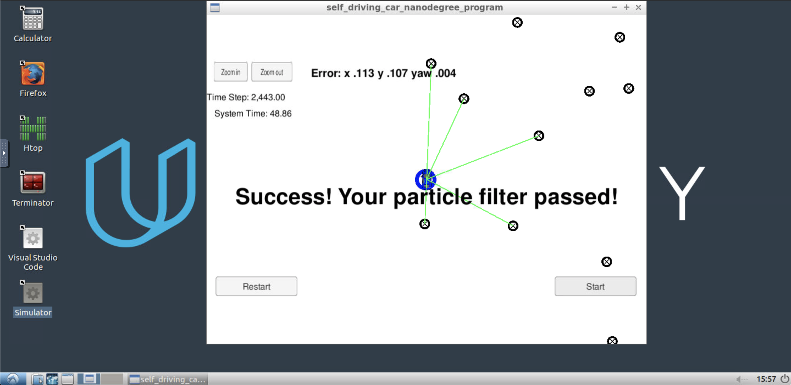

# Kidnapped Vehicle Project

This project is a part of:  
 [](http://www.udacity.com/drive)

## Project Introduction
Your robot has been kidnapped and transported to a new location! Luckily it has a map of this location, a (noisy) GPS estimate of its initial location, and lots of (noisy) sensor and control data.

This project is about to implement a 2 dimensional particle filter in C++. This particle filter will be given a map and some initial localization information (analogous to what a GPS would provide). At each time step your filter will also get observation and control data.

## Running the Code

To be able to run the project, you need the Term 2 Simulator as well as uWebSocketIO installed. Please look below.

### Simulator

This project involves the Term 2 Simulator which can be downloaded [here](https://github.com/udacity/self-driving-car-sim/releases).

If you don't have the simulator yet, please follow the [instructions here](https://github.com/gregtyminski/Behavioral-Clonning#environment-preparation).

### uWebSocketIO

This repository includes two files that can be used to set up and install uWebSocketIO for either Linux or Mac systems.
These files are:

* [install-mac.sh](install-mac.sh)
* [install-ubuntu.sh](install-ubuntu.sh)

For windows you can use either Docker, VMware, or even Windows 10 Bash on Ubuntu to install uWebSocketIO.

### Building the code

Once the install for uWebSocketIO is complete, the main program can be built and ran by doing the following from the project top directory:

1. ./clean.sh
2. ./build.sh
3. ./run.sh

Tips for setting up your environment can be found [here](https://classroom.udacity.com/nanodegrees/nd013/parts/40f38239-66b6-46ec-ae68-03afd8a601c8/modules/0949fca6-b379-42af-a919-ee50aa304e6a/lessons/f758c44c-5e40-4e01-93b5-1a82aa4e044f/concepts/23d376c7-0195-4276-bdf0-e02f1f3c665d)

### Results

After running program with the *100 particles* defined in `particle_filter.cpp` ...

```cpp
void ParticleFilter::init(double x, double y, double theta, double std[]) {
    num_particles = 100;  // the number of particles
    ...
```

... there are following results:

* x-error 		= 0.113
* y-error 		= 0.107
* yaw				= 0.004
* running time	= 48.86 seconds


